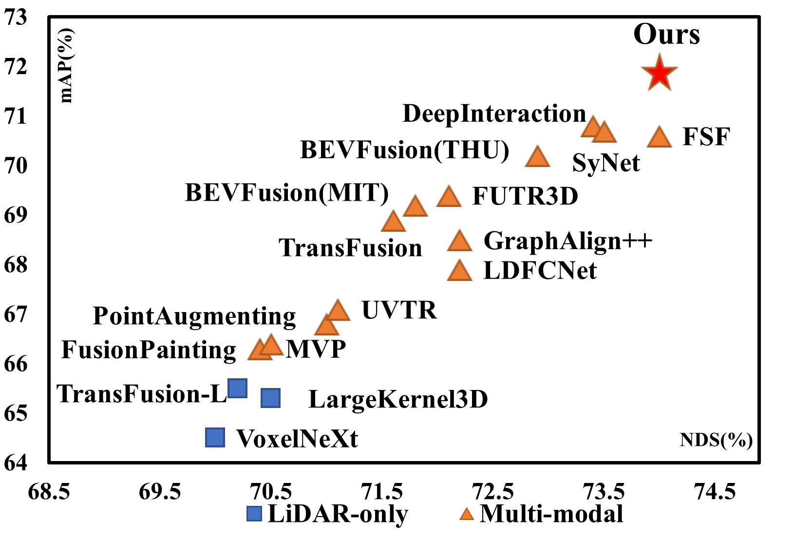
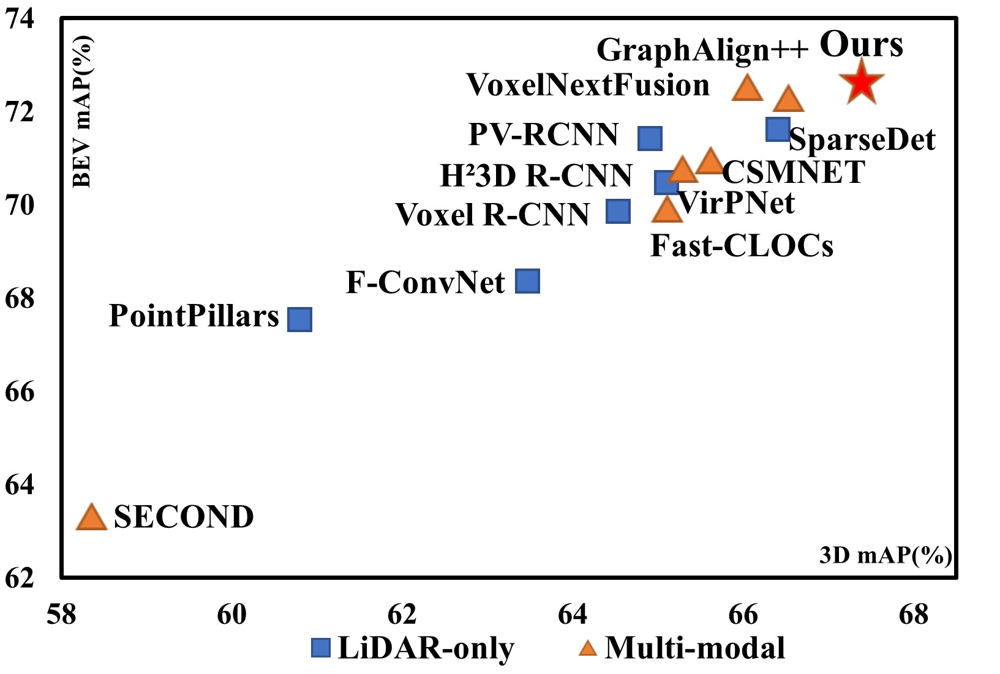

# PLPFusion: Plane-Line-Pixel Fully Sparse Fusion for Robust Multi-Modal 3D Object Detection
This repository contains the PyTorch implementation of the PLPFusion. This work introduces a hierarchical Plane-Line-Pixel representation to progressively model the object-context relationships.
 

